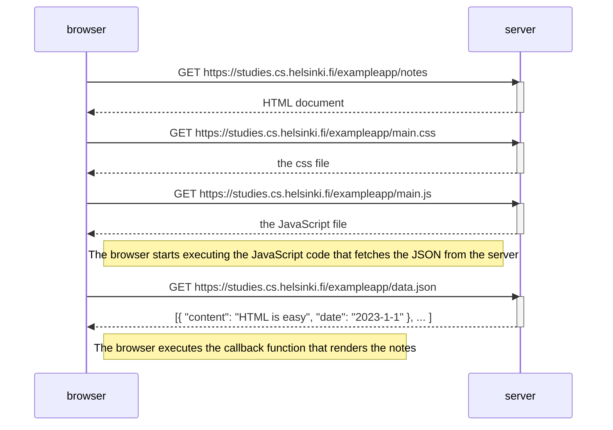
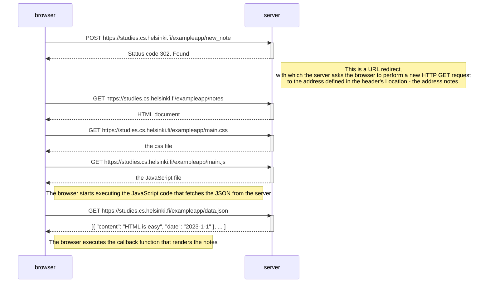
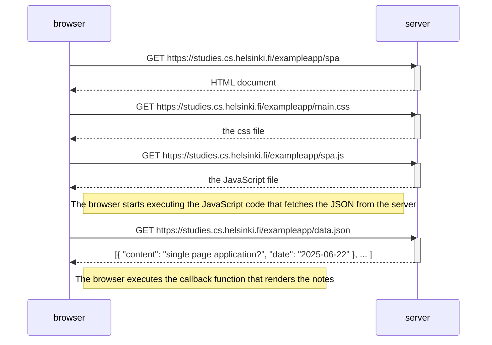
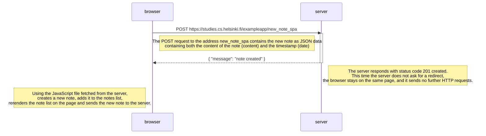

# Fullstack open: part 0

## Content

- [Description](#description)
- [Exercises](#exercises)

## Description

In this part of the course, we go through an example [webapp](https://studies.cs.helsinki.fi/exampleapp) provided by the course.

The task is to understand what is going on behind the scenes when rendering the page and adding a new note on the [notes](https://studies.cs.helsinki.fi/exampleapp/notes) page.

## Exercises

Part 0 of the course has 5 different exercises that mostly include reading through course material to get a better understanding of the languages used for webapp creation.

### Exercise 0.1: HTML

In this exercise we review the basics of HTML by reading this [HTML tutorial.](https://developer.mozilla.org/en-US/docs/Learn_web_development/Getting_started/Your_first_website/Creating_the_content)

### Exercise 0.2: CSS

In this exercise we review the basics of CSS by reading this [CSS tutorial.](https://developer.mozilla.org/en-US/docs/Learn_web_development/Getting_started/Your_first_website/Styling_the_content)

### Exercise 0.3: HTML forms

In this exercise we learn the basics of HTML forms by reading this [HTML form tutorial.](https://developer.mozilla.org/en-US/docs/Learn_web_development/Extensions/Forms/Your_first_form)

### Exercise 0.4: New note diagram

When reading through the course material we are provided with the following diagram on what is happening when rendering the [notes page](https://studies.cs.helsinki.fi/exampleapp/notes) of the exampleapp:

We are tasked with creating our own diagram using [Mermaid](https://github.com/mermaid-js/mermaid#sequence-diagram-docs---live-editor) syntax, explaining what happens when you add a new note in the exampleapp.

#### My solution

### Exercise 0.5: Single page app diagram

In this exercise we are tasked with implementing a diagram explaining what happens when rendering the single page version of the provided [expampleapp.](https://studies.cs.helsinki.fi/exampleapp/spa)

#### My solution

### Exercise 0.6: New note on Single page app diagram

In this exercise we are tasked with implementing a diagram explaining what happens while adding a new note on the single page version on the exampleapp.

#### My solution

This sequence diagram illustrates how the SPA loads resources only once and fetches new data via AJAX without a full page reload.
